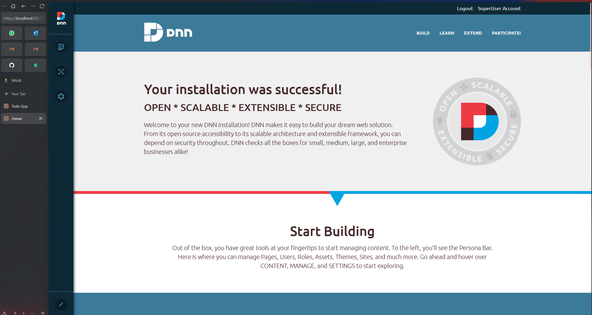
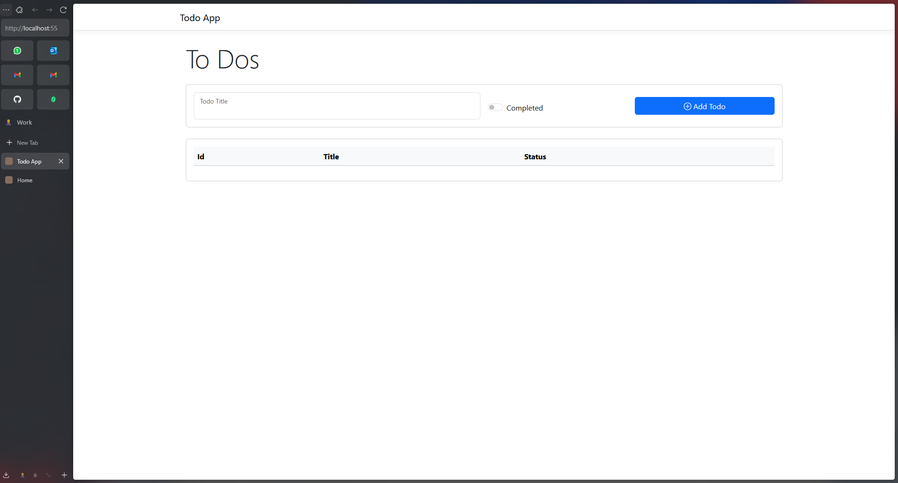

# Questions

1. **Did you have any problem installing any of the Dev Tools? Which one? How much time did it take you to solve it?**
   Yes, I was asked to install a tool called "Remote Machine Manager," but I couldn't find it or wasn't sure which tool it referred to. Installing all the required tools took me about half a day due to their size and dependencies.

2. **Did you understand all the steps on the Setup document? How will you improve it?**
   I understood all the steps except for the last one about installing Remote Machine Manager, which was unclear. To improve the document, I would clarify what Remote Machine Manager is, provide a direct link, and specify its purpose in the setup.

3. **Did you have any problem at the moment to run the app locally?**
   I didn't have any major issues running the DNN environment locally. The only minor issue was connecting to the SQL database: I ended up using SQL Express with Docker because I didn't have credentials for my locally installed database.

4. **Paste a screenshot of DNN running locally.**

5. **How many hours did it take you to complete this lab?**
   It took me around two days to complete the lab.
