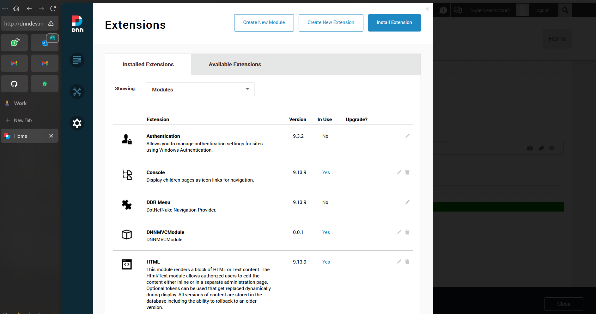
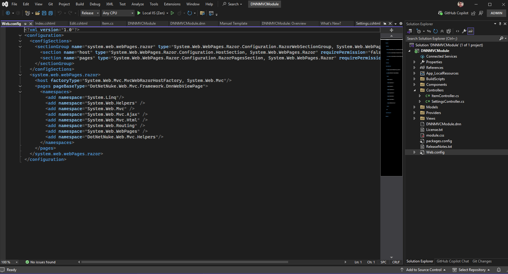
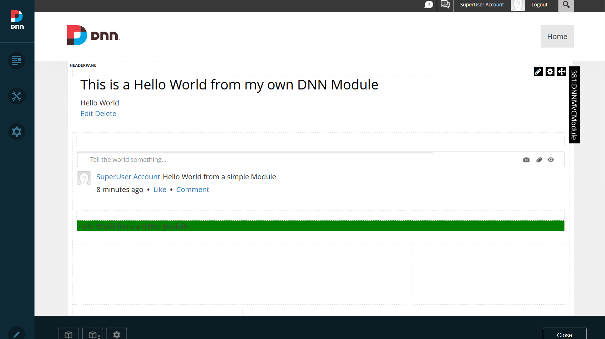

# Lab 2 - DNN Modules - Jose Manuel Morales Patty

1. Which are the differences between those 3 modules?
    - Custom Visual Studio Module: Full development approach requiring coding, compilation, and installation.
    - Journal Module: Pre-built social module added through the DNN interface. Selected as an alternative since HTML Pro is part of the Evoke package (premium/paid).
    - HTML Module: Simple content container for adding HTML directly through the DNN interface.

2. Pros and Cons of each one?
    - Custom VS Module
        Pros: Complete control, extensibility, reusability. Cons: Development time, technical complexity, maintenance requirements.
    - Journal Module
        Pros: Ready-to-use social features, no coding required. Cons: Limited customization options, specific functionality scope.
    - HTML Module
        Pros: Rapid implementation, straightforward content editing. Cons: Limited functionality, no data processing capabilities.

3. Did you have any problem during the creating/installation of the modules? Which one? How much time took to solve it? 
  The most significant challenge was the steep learning curve associated with permissions configuration. SQL Server connection issues required extensive documentation review, particularly regarding service accounts and security settings. File system permissions for both DNN and SQL Server demanded careful attention.
  Implementation required approximately 5 hours, with significant time dedicated to researching permissions documentation and security best practices rather than actual coding.

4. What is the purpose of Settings and Edit components? Difference against View.
    - View Component: Displays content to end users.
    - Edit Component: Controls content management - determines what information is presented.
    - Settings Component: Configures module behavior, display options, and permissions - determines how the module functions.

## Screenshots & Implementation

### Module View

### Code Implementation

### Overview of All Modules

