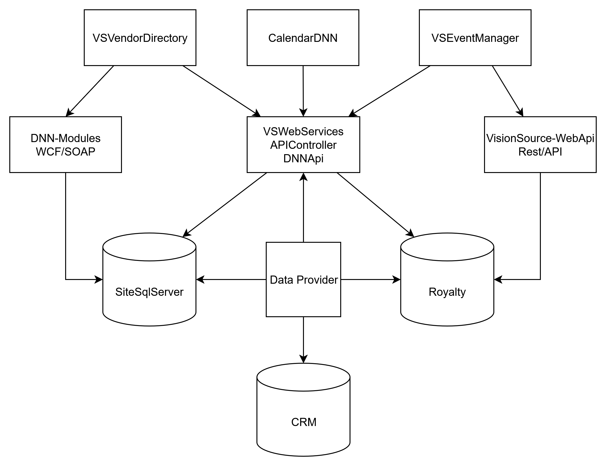
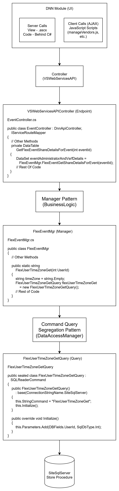
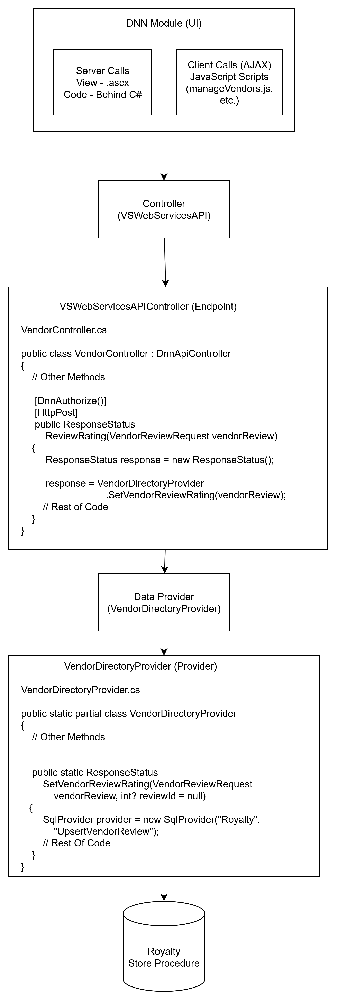

# Lab 3 - Review Old Code - Jose Manuel Morales Patty

## Identify the main characteristic of using this code and how it works on the website

After detailed analysis, these are the main characteristics of VisionSource:

1. **Multi-Tiered DNN-Based Architecture**:
   - **Presentation Layer**: Built on DotNetNuke (DNN) CMS using `.ascx` web controls
   - **Server-Side Logic**: Extensive C# code-behind for server rendering and state management
   - **Client-Side Interactions**: JavaScript/jQuery handling AJAX calls for dynamic content

2. **Dual Communication Patterns**:
   - **Legacy Services**: WCF/SOAP endpoints (`Service.svc`) for backward compatibility
   - **Modern APIs**: REST/WebAPI endpoints for newer features and mobile support
   - Both accessed through controllers exposed by DNN modules

3. **Multi-Repository Structure**:
   - **insight-dnn**: Contains DNN modules and UI components
   - **VisionSource.API**: Houses external-facing microservices
   - **data-provider**: Core data access components
   - **dnn-modules**: WCF service implementations

4. **Business Logic Organization**:
   - **Provider Pattern**: Static data access classes (e.g., `VendorDirectoryProvider`)
   - **Manager Pattern**: Business logic orchestration (e.g., `FlexEventMgr`)
   - Controllers choose whether to route through Managers or directly to Providers

5. **CQRS-Inspired Data Access**:
   - Command/Query separation for data operations
   - Direct stored procedure execution without ORMs

6. **Multi-Database Architecture**:
   - 10+ specialized databases (Royalty, VisionSource, CRM, etc.)
   - Database selection based on module/function (e.g., vendors → Royalty, events → VisionSource)
   - Cross-database operations coordinated through providers

7. **Microservice Integration**:
   - External API endpoints via REST services
   - Internal communication through both REST and WCF
   - Shared data provider layer across service types

## Do a quick diagram of the flow (UI, Endpoint, DB, Sproc)

### Flow Diagram (UI, Endpoint, DB, Sproc)



#### Data Flow Using Manager Pattern



#### Data Flow Using Provider Pattern



## Name the most common databases and endpoint for each module

### Most Common Databases and Their Roles

Looking at the codebase, the three most commonly used databases in the VisionSource ecosystem are:

1. **SiteSqlServer**
   - Serves as the primary DNN (DotNetNuke) platform database

2. **CRM**
   - Represents the CRM Database

3. **Royalty**
   - Represents the Royalty Database

### Key Event Management Endpoints

#### Calendar Management

- `GET events/{eventId}/share` - Returns users with whom a meeting is shared
- `GET CalendarAllEvents` - Retrieves calendar events with extensive filtering options
- `GET EventAttendeesByEventId` - Gets attendee list for a specific event

#### Guest List Operations

- `GET GetGuestsInList` - Retrieves guests in a specific list
- `GET AddGuest` - Adds a guest to a list
- `GET DeleteGuestInList` - Removes a guest from a list

#### Event Sharing

- `GET AddUserSharedMeeting` - Shares a meeting with specified users
- `GET DeleteUserSharedMeeting` - Removes users from a shared meeting

#### Vendor Listing & Search

- `GET GetVendors` - Retrieves filtered vendor directory with support for multiple filter types:
- `GET GetMyVendorsBook` - Retrieves bookmarked vendors for the current user:

#### Vendor Reviews & Ratings

- `POST ReviewRating` - Submits a review for a vendor, triggering notifications and VS Live posts:
- `POST ReplyReview` - Allows vendors to respond to reviews on their listing:
- `DELETE DeleteReview` - Removes a vendor review (admin function):

#### Vendor Management

- `POST AddNewVendor` - Creates a new vendor record and associated DNN user account:
- `GET GetUsers` - Search for DNN users (for associating with vendors):

## Did you have any problem during the review? Do you find some bugs or issues? Do you have some suggestions?

During the review, I encountered some suggestions that could be improved in the VisionSource codebase.

1. Extend Repository Documentation:

    - Create comprehensive wikis in each repository
    - Document system architecture, data flows, and integration points
    - Add detailed comments for complex business logic

2. Implement Custom Exception Types:

    ```csharp
    // Instead of generic exceptions:
    catch (Exception ex)
    {
        LogProvider.Instance().Write($"Exception in SendVendorUpdateEmail: {ex.Message}\n{ex.StackTrace}");
        throw new VendorEmailException($"Failed to send update email for vendor {vendorId}", ex);
    }
    ```

3. Use Interface-Based Design:

    ```csharp
    // Instead of static provider:
    public interface IVendorDirectoryProvider
    {
        Task<SubmitResponse> SendVendorUpdateEmail(int vendorId, string companyName);
        // Other methods...
    }

    public class VendorDirectoryProvider : IVendorDirectoryProvider
    {
        private readonly IEmailService _emailService;
        private readonly IConfiguration _configuration;

        public VendorDirectoryProvider(IEmailService emailService, IConfiguration configuration)
        {
            _emailService = emailService;
            _configuration = configuration;
        }

        public async Task<SubmitResponse> SendVendorUpdateEmail(int vendorId, string companyName)
        {
            // Implementation with dependencies injected
        }
    }
    ```

4. Replace String Literals with Constants/Enums:

    ```csharp
    // Instead of:
    SqlProvider provider = new SqlProvider("VSBackOffice", "spCheckLatestUpdates");

    // Use:
    public static class DatabaseNames
    {
        public const string VSBackOffice = "VSBackOffice";
        public const string Royalty = "Royalty";
        // Other database names
    }

    public static class VendorProcedures
    {
        public const string CheckLatestUpdates = "spCheckLatestUpdates";
        public const string GetVendorDirectory = "spGetVendorDirectory";
        // Other procedures
    }

    SqlProvider provider = new SqlProvider(DatabaseNames.VSBackOffice, VendorProcedures.CheckLatestUpdates);
    ```

5. Reorganize File Structure to "Screaming Architecture":

    - Current structure:

    ```plaintext
    /Business
      VendorDirectoryProvider.cs
      EventManager.cs
    /Definition
      /VendorDirectory
          VendorDirectory.cs
    /Schema
      ...
    ```

    - Suggested structure:

    ```plaintext
    /Features
      /VendorDirectory
          /Business
            VendorDirectoryProvider.cs
          /Definition
            VendorDirectory.cs
          /Schema
            ...
      /EventManager
          /Business
            EventManagerProvider.cs
          /Definition
            ...
    ```

6. Add Comprehensive Integration Tests:
    - Create tests that verify correct stored procedure calls
    - Mock external dependencies like SendGrid
    - Test error handling paths
